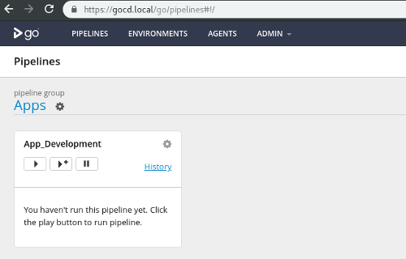
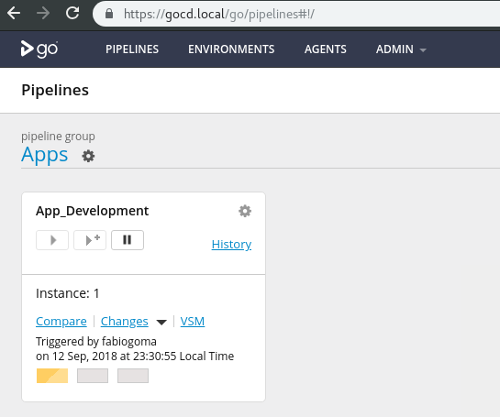
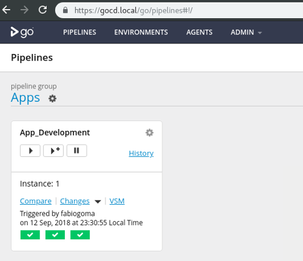

# GoCD Pipelines

This project contain a small demo of a GoCD pipeline that is used to deploy a small web application. Although it's not mandatory, it's strongly recommended that you use this project in a combination with another project called [gocd-vagrant](https://github.com/fabiogoma/gocd-vagrant).

## Project structure

This project is structured in way to maintain the GoCD YAML pipelines, also some ansible playbooks used for deployment and testing:

```bash
$ tree .
.
├── apps
│   ├── 1.app-development.gocd.yaml
│   └── 1.environments.gocd.yaml
├── playbooks
│   ├── ansible.cfg
│   ├── app-deployment-playbook.yml
│   ├── app-tests-playbook.yml
│   ├── hosts
│   └── tests
│       ├── app
│       │   ├── controls
│       │   │   └── app.rb
│       │   ├── inspec.lock
│       │   ├── inspec.yml
│       │   └── README.md
│       └── nginx
│           ├── controls
│           │   └── nginx.rb
│           ├── inspec.lock
│           ├── inspec.yml
│           └── README.md
└── README.md

7 directories, 15 files
```

## Pipeline progress

<p align="center">
  
</p>

<p align="center">
  
</p>

<p align="center">
  
</p>
